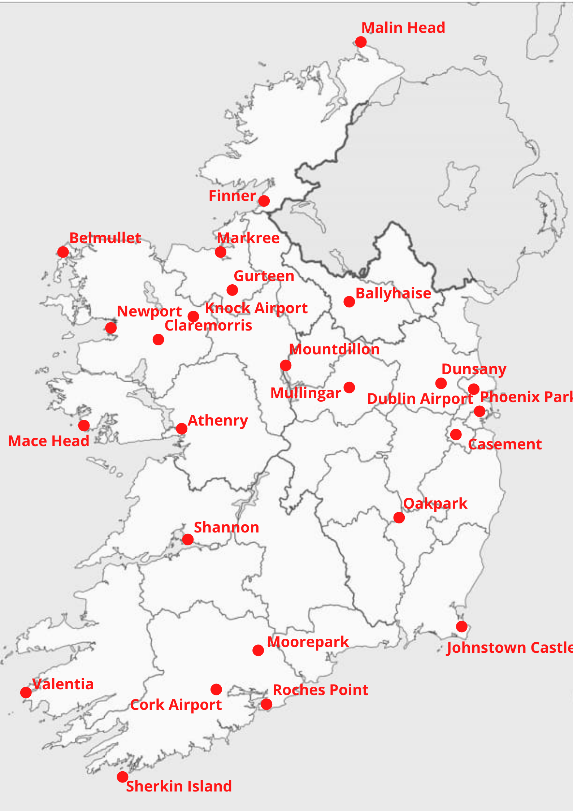
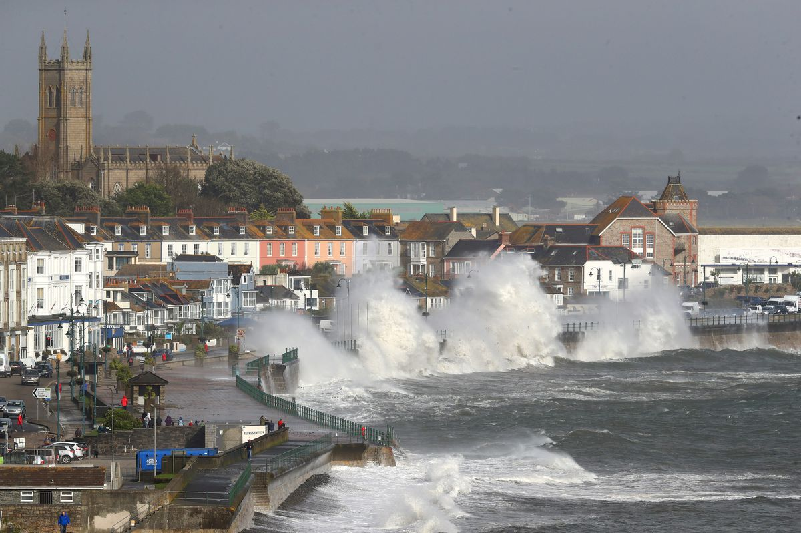
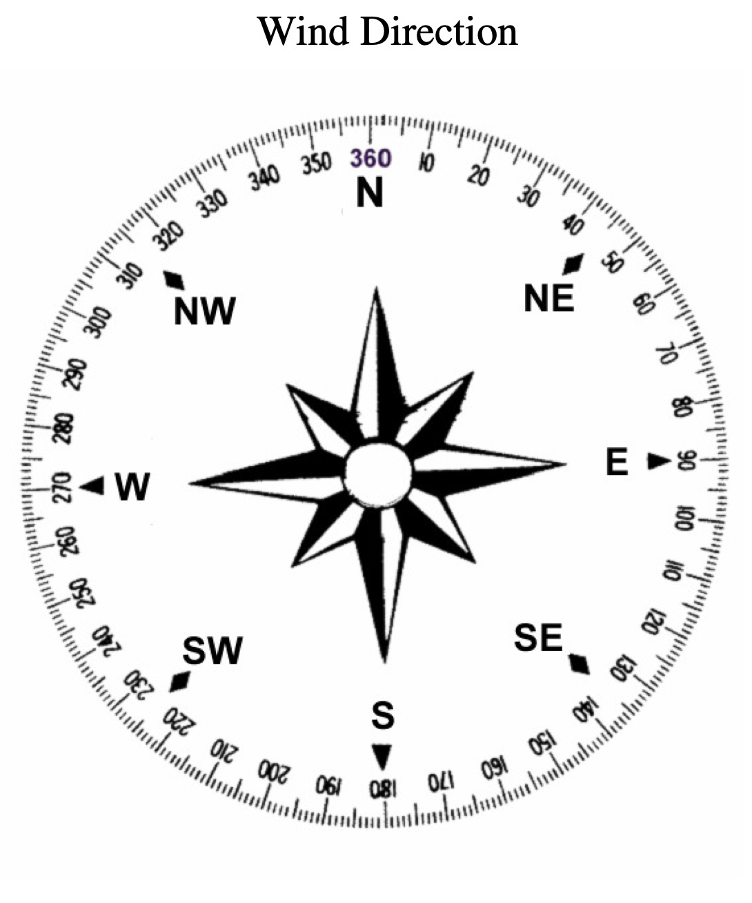

```{r setup, include=FALSE}
library(dplyr)
library(ggplot2)
library(ggpubr)
library(aimsir17)
library(tidyr)
library("stringr")
library(tidyverse)

knitr::opts_chunk$set(echo = TRUE,warning=FALSE,message = FALSE,fig.width = 11,fig.height = 8)
```


## Irish Weather Warnings for 2017{.tabset}
### Synopsis
__Introduction__ : Weather warnings and how different parts of Ireland experienced them. The weather warning analysis was carried out on the aimsir17 dataset package, which includes all-weather station observations for the year 2017. This dataset consists of 219,000 rows, where each row corresponds to an hourly recording for each of the 25 stations throughout Ireland. The locations of each station are shown below.

```{r, echo=FALSE,out.width="70%",fig.align = 'center', fig.cap="Station locations"}

```


__Objective__ : The objective of the project is to examine the wind speed and Rainfall data in Ireland during the year 2017. To understand the main trends in Irish weather, the analysis is structured as follows: 
\
1. Weather Warnings:
   What are all the different warning classifications for rain and wind-based data? 
\
2. Warnings:
   How many weather warnings were recorded by stations in Ireland? How was the number of recordings for each station related to others? 
\
3. Relationship between weather warnings for wind-based and rain based classifications:
  The comparison of rain warnings concerning wind warnings is analysed
\
4. Exploring a red weather event: Storm Ophelia:
   On October 16th, 2017, Storm Ophelia landed in Ireland. This notable red weather event can be explored. The various aspects of the storm are analysed such as lowest atmospheric pressure across stations, rainfall, wind speed, and wind direction analysis concerning time for the day.
   
---
__Solution__ : The data provides a useful insight into the Weather Level of the  Irish weather. Several packages in R were used to obtain these results.

---

__Insights__ : Various insights were drawn through the analysis, such as:
\
* Coastal weather stations located west and south recorded significantly more weather warnings than stations situated inland.
\
* Comparing weather warnings for rainfall and wind speed, it was found that wind speed accounted for more weather events. The data decisively shows that both categories are not correlated.
\
* Analysis of the Storm Ophelia red weather event on October 16th showcased the major differences in wind speed recorded by stations close to the south and west coasts when compared to eastern and mainland stations.
\
* Wind direction analyses allowed us to visualize the angles of wind recorded by stations. This is done to gain a better understanding as to why different regions issue different warnings or have none at all.
\
* A monthly analysis of wind and rain weather events showed that Ireland experienced the majority of weather warnings from October to February. 
\ 

---

__Authors' statements__ :

I ERNESTAS KRIAUCIUNAS had primary responsibility for the material in section Synopsis, Summary, and General analysis section under Data Analysis tab.
\
I ILIA POSTOLOV had primary responsibility for the data set in the section Data Preparation tab.
\
I NARESH KUMAR NAGARAJ had primary responsibility for the material in section Storm Ophelia and the plots in section General Analysis section under Data Analysis tab.
\
I JINGCHEN ZHANG had primary responsibility for the part Rain vs Wind in section General Analysis under Data Analysis tab.


---

### Packages Requirement

The following packages were used in the project:

* aimsir17
* ggplot2
* dplyr
* Knitr
* tidyr
* shiny
* stringr
* tidyverse


### Data Preparation {.tabset}

This section describes the main steps undertaken in the current analysis.

#### Data Import

__Source of Data__ : "Irish weather data for 2017" is available from package aimsir17.

__Data Name__ : observations
\
__Import command__ : 
\
A short summary of what is contained within the main dataset is shown here:
```{r}
options(width = 120)
data<- observations
head(data)
```
\
The following variables are recored for each observation:
\

* station (weather station name)
* year (2017)
* month (month of year 1-12)
* day (day of month 1-31)
* date (date object in R)
* rain (hourly rainfall in mm)
* temp (hourly temperature in C)
* rhum (Relative Humidity - percent)
* msl (Mean Sea Level Pressure - hPa)
* wdsp (Mean Wind Speed - knots)
* wddir (Predominant Wind Direction - degree)

```{r}
colnames(data)
```
\
Dimension of the table:
\
```{r}
dim(data)
```

#### Data Preview

```{r}
options(width = 120)
head(data)
```

#### Data Description
\
__Data Cleaning__ : 
The main variables of interest in our research are the rain and wdsp columns. Met Eireann issues weather warnings for regions where the total rainfall and/or strength of wind exceeds specific values. The severity of a warning can be broken down into 3 distinct categories named by color. For our columns of interest, these can be broken down into:
\

```{r, echo=FALSE}
Values <- matrix(c("30-50","27-35","50-80","35-43","80+","43+"),ncol=2,byrow=TRUE)
colnames(Values)<-c("RainFall (mm)","wind speed(knots)")
rownames(Values)<-c("Yellow","Orange","Red")
subjects1<-as.table(Values)
knitr::kable(Values, caption="Weather warnings for 24-hour rainfall sum and wind speed values")
```
We start by creating new columns to add to the existing data set, that will give a weather warning classification based on the values shown above. The rain column is summed every 24 rows and if a match is made to one of the three classifications, then it is classified accordingly. For the days where there is no match, a "Clear" is stated. Similarly, for the wdsp column, each recording gets classified based on the above numbers and is labeled "Clear" if no match is made. To do this I had to use a For loop for each row in the column checking the sum and making "temporary" variables for comparison (the code for the aforementioned process is included below):

```{r, eval=F, echo=T}

library(aimsir17)
Data$RainLevel<- NA
Data$WindLevel <- NA
Data$WeatherLevel<- NA
Data$DayWindLevel <- NA
fT<-0
f<-0
WindLevel<-0

  for(i in 1:nrow(Data))
  {
    
    if(Data$hour[i] == 0){ 
    fT<-0
    f<-0
    DayTemp <- NA 
    RainTemp <- 0 }
    
    WindTemp <- Data$wdsp[i]
    
    RainTemp <- RainTemp + Data$rain[i]
    
    ifelse (WindTemp < 27,Data$WindLevel[i]<-"Clear" ,ifelse(WindTemp < 35,Data$WindLevel[i]<-"Yellow" ,ifelse(WindTemp < 43,Data$WindLevel[i]<-"Orange" ,Data$WindLevel[i]<-"Red")) ) 
    
    ifelse (RainTemp < 30,Data$RainLevel[i]<-"Clear",ifelse(RainTemp < 50,Data$RainLevel[i]<-"Yellow",ifelse(RainTemp < 80,Data$RainLevel[i]<-"Orange",Data$RainLevel[i]<-"Red"))) 
    
    ifelse(Data$RainLevel[i]=="Yellow"  || Data$WindLevel[i]=="Yellow", fT <- 1,ifelse(Data$RainLevel[i] =="Orange" || Data$WindLevel[i] == "Orange",fT <-2,ifelse(Data$RainLevel[i]=="Red" || Data$WindLevel[i]=="Red", fT <-3, fT <- 0)))   
   
     Hour <- Data$hour[i]

if (f < fT) f <- fT 
     
if(!is.na(Data$wdsp[i])){if (WindLevel < Data$wdsp[i]) WindLevel <- Data$wdsp[i]}
    
    
    if(Hour == 23){
      if(f==0)  Data$WeatherLevel[i] <-"Clear"
      if(f==1)  Data$WeatherLevel[i] <-"Yellow"
      if(f==2)  Data$WeatherLevel[i] <-"Orange"
      if(f==3)  Data$WeatherLevel[i] <-"Red"
      
      if(WindLevel == 0)Data$DayWindLevel[i] <- NA
      else Data$DayWindLevel[i] <- WindLevel
      WindLevel <-0
    }
  }
head(Data)
write.csv2(Data, "New_Data_omit.csv")
```

Further data cleaning is needed since our RainLevel column gives the rain warning for the day and the WindLevel column gives the wdps warning for hourly values. A new column is made which classifies a wind warning for the whole day based on the severity of warnings that are detected in 24 hours, similarly to the RainLevel column. For example, if our algorithm were to detect an "orange" and a "yellow" warning in that period, we will classify the daily wind warning to be "orange" as this is the most severe warning detected.

This process allows filtering the 219,000 rows of data to just 8,369 rows as only 1 row of data for every 24 rows is kept with the relevant information. Every other row is omitted from the dataset so that we can look at the daily information recorded from the stations. Note also that the Phoenix Park and Markree stations did not record wind speed and so it got omitted from the original dataset which is why we reach 8,369 rows and not 219,000/24= 9,125 rows.

The last modification that is added is the WeatherLevel column that gives a summary of the most severe warning in place for that day. This takes into account both the RainLevel and the WindLevel columns to produce the summarized warning for the day. This is then followed by a new column called Warning that gives a "None" or a "Warning" factor for the day.

```{r, echo=FALSE}
data2<-read.csv("New_Data_omit.csv")
data2_omit<-na.omit(data2)
x2 <- data2_omit$WeatherLevel
w_day <- ifelse(x2=="Yellow","Warning",ifelse(x2=="Orange","Warning",ifelse(x2=="Red","Warning","None")))
data2_omit$Warning<- factor(w_day)

#Set up factors in the right order
data2_omit$RainLevel <- factor(data2_omit$RainLevel, levels = c("Clear","Yellow","Orange","Red"))
data2_omit$WindLevel <- factor(data2_omit$WindLevel, levels = c("Clear","Yellow","Orange","Red"))
data2_omit$WeatherLevel <- factor(data2_omit$WeatherLevel, levels = c("Clear","Yellow","Orange","Red"))
data2_omit$DayWindLevel <- factor(data2_omit$DayWindLevel, levels = c("Clear","Yellow","Orange","Red"))

#omitting the none values from the data
omit_for_warning<- data2_omit %>%filter(str_detect(data2_omit$Warning, "None", negate = TRUE))
omit_for_warning$DATE = substr(omit_for_warning$date,1,10)

#to show how many weather events we had in total
d_loc_rev <- data2_omit %>% filter(str_detect(data2_omit$Warning, "None", negate = TRUE)) %>% group_by(WeatherLevel) %>% summarise(count=n())%>% mutate

head(omit_for_warning)
colnames(omit_for_warning)
dim(omit_for_warning)
```


### Data Analysis {.tabset}

#### General analysis

##### General Analysis and Changes in Irish Weather.
\
We analysed the total number of weather warnings that were recorded by each station. Days, where no weather warnings were in place, were omitted, and so we are left with a clear picture of the total weather events recorded by severity.
\
```{r, echo=FALSE,out.width="50%", out.height="60%",fig.cap="$\\small{Figure}$ $\\small{1:}$ $\\small{Total}$ $\\small{Weather}$ $\\small{Warnings}$ $\\small{based}$ $\\small{on}$ $\\small{classifications}$",fig.show='hold',fig.align='center'}
ggplot(data=d_loc_rev)+
  geom_bar(mapping=aes(x=WeatherLevel, y=count),fill=c("Yellow", "Orange", "Red"),stat="identity")
```
\
In our analysis, we see that 436 station recordings had a weather event. The severity of these events decreases exponentially. We expect to see different regions of Ireland experiencing more/fewer weather events due to their locations.

We analyse how many weather events are recorded by the stations with the highest count of weather events below.
\
```{r, echo=FALSE,out.width="50%", out.height="40%",fig.cap="$\\small{Figure}$ $\\small{2:}$  $\\small{Stations}$ $\\small{with}$ $\\small{Heighest}$ $\\small{Weather}$ $\\small{Warnings}$",fig.show='hold',fig.align='center'}
#3
#highest warnings
highest <- omit_for_warning %>% filter(str_detect(omit_for_warning$Warning, "None", negate = TRUE)) %>% 
  group_by (station) %>% summarise(count=n()) %>% arrange(desc(count))

highest_5<-head(highest,5)

ggplot(highest_5, aes(x=reorder(station, -count),y=count, fill= count))+ geom_col(position = "dodge")+
  xlab("Stations")+ylab("Count")+theme_minimal()
```
\

```{r, echo=FALSE,out.width="50%", out.height="40%",fig.cap="$\\small{Figure}$ $\\small{3:}$ $\\small{Stations}$ $\\small{with}$ $\\small{Fewest}$ $\\small{Weather}$ $\\small{Warnings}$",fig.show='hold',fig.align='center'}
#2
#lowest warnings
lowest <- omit_for_warning %>% filter(str_detect(omit_for_warning$Warning, "None", negate = TRUE)) %>% 
  group_by (station) %>% summarise(count=n()) %>% arrange((count))
lowest_5<-head(lowest,5)

ggplot(lowest_5, aes(x=reorder(station, -count),y=count, fill= count))+ geom_col(position = "dodge")+
  xlab("Stations")+ylab("Count")+theme_minimal()
```
\
This is a count of total weather events recorded by each station, note that out of 25 station recordings we are only left with 22 stations. This is due to Phoneix Park and Markree stations not providing any wdsp data and also having no rain warnings in their recordings. Another important note is that the station Ballyhaise had no weather warnings recorded, so the count is 0.
\
```{r}
count_frame_bally <- data2_omit %>% filter(station=="BALLYHAISE") %>% group_by(station="BALLYHAISE")%>% count(Warning, .drop=FALSE)
count_frame_bally
```
\
From this analysis, we can see that the top 5 stations accounted for 280 weather warnings in total. This is 64% of total weather warnings for the year. In comparison, the 5 stations with the fewest number of warnings account for only 2.7% of all-weather warnings.
\
```{r, echo=FALSE,fig.cap="$\\small{Figure}$ $\\small{4:}$ $\\small{Difference}$ $\\small{in}$ $\\small{Recorded}$ $\\small{Weather}$ $\\small{Events}$ $\\small{by}$ $\\small{Station}$",fig.show='hold',fig.align='center'}
#most number of weather classifications with respect to station
omit_for_warning %>% 
  ggplot(aes(x=omit_for_warning$station, y=omit_for_warning$Warning,fill=WeatherLevel), position = "fill") +scale_fill_manual(values=c("#FFFF00", "#FF9900", "#FF0000"))+
  geom_bar(stat="identity")+coord_flip()+
  xlab("List of weather stations")+ylab("Count")+theme_minimal()
```
\


##### Rain vs Wind
\
For this analysis, we will only be looking at days when there is a weather warning, which implies that at least one element between rainfall and wind produced a warning. 
\

```{r, echo=FALSE,fig.cap="$\\small{Figure}$ $\\small{5:}$ $\\small{Different}$ $\\small{Levels}$ $\\small{of}$ $\\small{Wind}$ $\\small{Warning}$ $\\small{for}$ $\\small{each}$ $\\small{level}$ $\\small{of}$ $\\small{Rain}$ $\\small{Warning}$ $\\small{by}$ $\\small{Month}$ $\\small{across}$ $\\small{all}$ $\\small{Stations}$" ,fig.show='hold',fig.align='center'}
colors <- c("Clear" = "light blue", "Yellow" = "yellow", "Orange" = "orange", "Red" = "red")
ggplot(data = omit_for_warning) +
  geom_bar(mapping = aes(x = RainLevel, fill=DayWindLevel)) +
  scale_color_manual(values = colors, aesthetics = c("color","fill")) +
  facet_wrap(~month)
```
\


##### Hypothesis Testing
\
To explore whether there is a correlation between rainfall and wind, we employed the method of hypothesis testing using chi-squared analysis. 

Null hypothesis: when a rain warning is produced, a wind warning is also produced. i.e. the number of rain and wind warnings are equal

Alternative hypothesis: the number of rain and wind warnings are not equal
\
```{r}
rainWarningCount <- sum(omit_for_warning$RainLevel != "Clear")
windWarningCount <- sum(omit_for_warning$DayWindLevel != "Clear")
warningTable <- matrix(data=c(rainWarningCount,windWarningCount), nrow=1, ncol=2, byrow=T)
colnames(warningTable) <- c('Rain Warnings','Wind Warnings')

ctest <- chisq.test(warningTable)
ctest
```
\
As we can see, the p-value is smaller than 0.05 by a great margin. The evidence very strongly suggests that the number of rain and wind warnings are not equal. We can also visualize this on a graph:
\
```{r, echo=FALSE,out.width="50%", out.height="40%",fig.cap="$\\small{Figure}$ $\\small{6:}$ $\\small{Observed}$ $\\small{and}$ $\\small{Expected}$",fig.show='hold',fig.align='center'}
expectedTable <- matrix(data=c(nrow(omit_for_warning)/2,nrow(omit_for_warning)/2), nrow=1, ncol=2, byrow=T)

barplot(warningTable, ylim=c(0,400))
barplot(expectedTable, add=T,col=rgb(0, 0, 1, alpha=.1))
```


#### Storm Ophelia

\
Storm Ophelia hits Ireland, prompting the first-ever severe weather alert for the entire country. -Oct 16, 2017.
\

```{r, echo=FALSE,out.width="70%", out.height="90%",fig.align = 'center',fig.cap="Storm Ophelia's Impact"}

```
\

Ophelia was regarded as the worst storm to have affected Ireland in the last 50 years and was also the easternmost Atlantic major hurricane on record.
\

\

##### Analysis on Storm Ophelia 
```{r}
o <- observations %>%
  filter(month==10, day==16)
head(o)
```
\


##### Wind Direction Analysis

```{r, echo=FALSE,out.width="30%", out.height="50%",fig.align = 'center'}

```
\
```{r, echo=FALSE}
Values1 <- matrix(c("North","0","East","90","South","180","West","270"),ncol=2,nrow=4,byrow=TRUE)
colnames(Values1)<-c("Direction of Wind is coming from","Angle(in Degree)")
rownames(Values1)<-c("1","2","3","4")
subjects2<-as.table(Values1)
knitr::kable(Values1, caption="Major Wind Angles")
```
\
Now let's take a look at the direction of wind coming in to the weather stations. So, we are considering the station which had the maximum impact of wind speed. Roches Point, in Cork had the maximum impact of wind due to the Storm Ophelia. 
\
```{r}
highest<- o %>% arrange(desc(wdsp)) %>% 
  slice(1:1) %>% 
  pull(station) %>%
  unique()
highest
```
\
```{r, echo=FALSE,fig.cap="$\\small{Figure}$ $\\small{7:}$ $\\small{Wind}$ $\\small{Direction}$ $\\small{at}$ $\\small{Roches}$ $\\small{Point}$ $\\small{On}$ $\\small{October}$ $\\small{16th,}$ $\\small{based}$ $\\small{on}$ $\\small{Hour}$",fig.show='hold',fig.align='center'}
rochespoint<- dplyr::filter(o, station %in% c("ROCHES POINT"))
plot<-ggplot(rochespoint, aes(x=hour, y=wddir))+geom_line(color = "Blue",linetype = "dotdash",lwd=1) 
plot+ scale_y_continuous(limits = c(0, 360), breaks = seq(0, 360, by = 90))+
  xlab("Hour")+ylab("Wind Angles(in Degree)")
```
\
By looking into the above plot, we can clearly say that at Roches Point on October 16th  morning the Wind started from the South-East direction. Later from noon during the storm, wind occurred constantly from South-West direction hitting towards North-East direction in Ireland till EOD on October 16th.
\


##### Rainfall Analysis
\
```{r, echo=FALSE,out.width="50%", out.height="40%",fig.cap="$\\small{Figure}$ $\\small{8:}$ $\\small{Rainfall}$ $\\small{across}$ $\\small{all}$ $\\small{Stations}$ $\\small{on}$ $\\small{October}$ $\\small{16th}$",fig.show='hold',fig.align='center'}

#2)Rainfall
ggplot(o, aes(x=hour, y=rain,fill= station)) + 
  geom_col()+
  coord_flip()+
  xlab("Hour")+ylab("Rain (in mm)")
```
\
Number of records gathered:
\
```{r, out.width="60%", out.height="60%"}
#number of records gathered
o %>% 
  group_by(station, day) %>%
  summarise(TotalObservations=n()) %>%
  pivot_wider(names_from = day,values_from = TotalObservations) %>%
  print(n=25)
```
\
Order the hour from driest to wettest:
\
```{r}
#Order the hour from driest to wettest
o %>% 
  group_by(hour) %>%
  summarise(TotalRainfall=sum(rain,na.rm = T)) %>%
  arrange(TotalRainfall) %>%
  print(n=12)

```
\
Finally, order the weather stations from driest to wettest, with an index value where 3 is the wettest on a day for 2017. The index reflects how much precipitation is received relative to the long-term average for a specified area and timeframe.
\
```{r}
#Finally, order the weather stations from driest to wettest, with an index value where 3 is the wettest on a day for 2017 (Newport!)
o %>% 
  group_by(station) %>%
  summarise(TotalRainfall=sum(rain,na.rm = T)) %>%
  arrange(TotalRainfall) %>%
  mutate(Index=3*TotalRainfall/max(TotalRainfall)) %>%
  print(n=25)
```
\
The stations with the top five rainfall, on the day when Storm Ophelia occured:
\
```{r}
#The stations with the highest rainfall hourly can be found
highest<- o %>% arrange(desc(rain)) %>% 
  slice(1:10) %>% 
  pull(station) %>%
  unique()
highest
```
\
```{r, echo=FALSE,fig.cap="$\\small{Figure}$ $\\small{9:}$ $\\small{Top}$ $\\small{Five}$ $\\small{Stations}$ $\\small{with}$ $\\small{Heighest}$ $\\small{Rainfall}$ $\\small{on}$ $\\small{October}$ $\\small{16th}$",fig.show='hold',fig.align='center'}
ggplot(filter(o,station %in% highest),aes(x=date,y=rain,color=station))+
  geom_point()+geom_line()+
  xlab("Date with respect to Hour")+ylab("Rain (in mm)")
```

---

##### Wind Speed Analysis

\
The stations with the highest mean hourly wind speed on October 16th:
\
```{r}
#The stations with the highest mean hourly wind speed can be found
highest<- o %>% arrange(desc(wdsp)) %>% 
  slice(1:15) %>% 
  pull(station) %>%
  unique()
highest
```
\
```{r, echo=FALSE,fig.cap="$\\small{Figure}$ $\\small{10:}$ $\\small{Top}$ $\\small{Five}$ $\\small{Stations}$ $\\small{with}$ $\\small{Heighest}$ $\\small{wind speed}$ $\\small{on}$ $\\small{October}$ $\\small{16th}$",fig.show='hold',fig.align='center'}
ggplot(filter(o,station %in% highest),aes(x=date,y=wdsp,color=station))+
  geom_point()+geom_line()+
  xlab("Date with respect to Hour")+ylab("wdsp (Mean Wind Speed - knots)")
```
\

In our analysis we can show the 24-hour windspeed changes. The top 5 stations with highest windspeed are represented on the above plot. The heatmap plot below, showcases the duration of high windspeed detection on Oct 16.

\
```{r, echo=FALSE,fig.cap="$\\small{Figure}$ $\\small{11:}$ $\\small{Heat}$ $\\small{Map}$ $\\small{of}$ $\\small{wind speed}$ $\\small{by}$ $\\small{Hour}$ $\\small{on}$ $\\small{October}$ $\\small{16th}$",fig.show='hold',fig.align='center'}
##to fetch top stations with highest wind speed
stations_hwdsp<- dplyr::filter(o, station %in% c("ROCHES POINT","SherkinIsland","CORK AIRPORT","SHANNON AIRPORT","CASEMENT"))
#HEATMAP with respective for the specific day
ggplot(stations_hwdsp, aes(x=hour, y=day)) +
  geom_tile(aes(fill = wdsp))+scale_fill_gradientn(colors = c("steelblue", "tomato"))+facet_wrap(~station)
```


---


### Summary
\
Understanding how weather events get classified according to their severity is important for day-to-day life. Ireland's geographical location is a prime reason why this is critical. Facing directly towards the Atlantic Ocean means that weather events are numerous throughout the year. Correct weather classifications are crucial if safety measures need to be put in place.
\

The idea of the research presented in this project was to analyse weather station data to help us understand which regions of Ireland experience the most weather events. In our analysis, it was found that there were major differences between stations. Particularly, out of the 436 records of daily weather events, it was seen that the top 5 stations had 64% of total weather event recordings. This is convincing evidence that stations facing the Atlantic Ocean recorded the majority of weather events.
\

When analysing rain and wind data, the assumption was that when there is heavy wind, there would be heavy rainfall too. Since Met Eireann classifies these separately, it was interesting to analyse whether both categories would be correlated. In the monthly analysis of weather warnings, it was found that there was very little correlation with both. A chi-sq test was performed on the total number of rain and wind warnings and the p-value for the result was << 0.05 giving strong evidence against that assumption.
\

By looking at Storm Ophelia, a notable red weather event which occurred during the year 2017 in Ireland, we could analyse the stations with the highest wind speed & rainfall, and the wind direction across all the stations. We are able to map out and visualize the impact of Storm Ophelia on the top 5 stations.

---